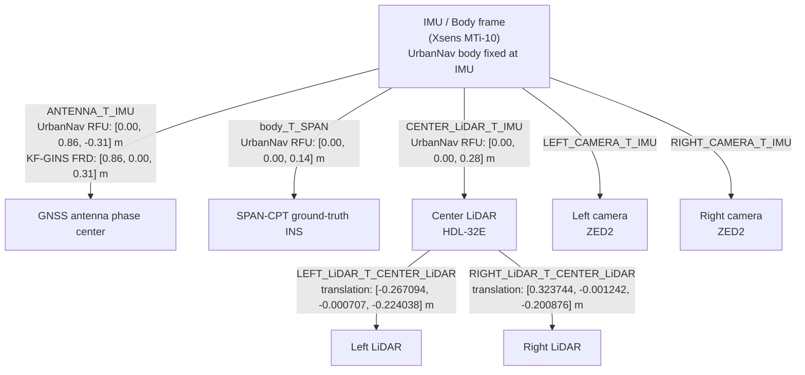

# UrbanNav Medium Urban: KF-GINS Mount Parameters

Source files:

- [dataset/urban_nav/medium_urban/extrinsic.yaml](/home/sandyz/Documents/navigation/KF-GINS/dataset/urban_nav/medium_urban/extrinsic.yaml)
- [dataset/urban_nav/medium_urban/xsense_imu.yaml](/home/sandyz/Documents/navigation/KF-GINS/dataset/urban_nav/medium_urban/xsense_imu.yaml)
- [config/kf-gins.yaml](/home/sandyz/Documents/navigation/KF-GINS/config/kf-gins.yaml)
- [src/kf_gins.cpp](/home/sandyz/Documents/navigation/KF-GINS/src/kf_gins.cpp)

## What Can Be Reconstructed

The dataset contains sensor extrinsics and IMU noise parameters, so it is possible to reconstruct the sensor mounting topology needed by KF-GINS.

What it does **not** contain is the original annotated vehicle photo like the UrbanNav GitHub image. That image is a manually drawn reference figure, not something embedded in the bag or calibration files.

## Frame Convention

UrbanNav `extrinsic.yaml` states:

- body frame is fixed at the IMU frame
- antenna translation is measured in axes: `y forward, x right, z up`

KF-GINS expects the GNSS antenna lever arm in the IMU/body frame ordered as:

- `forward, right, down`

So the axis conversion is:

- `forward = UrbanNav y`
- `right = UrbanNav x`
- `down = -UrbanNav z`

## KF-GINS Critical Parameter

UrbanNav gives:

- `ANTENNA_T_IMU.translation = [x_right, y_forward, z_up] = [0.00, 0.86, -0.31] m`

Converted to KF-GINS:

```yaml
antlever: [0.86, 0.00, 0.31]
```

This is the quantity loaded by KF-GINS as "position of GNSS antenna phase center in IMU frame":

- [src/kf_gins.cpp:351](/home/sandyz/Documents/navigation/KF-GINS/src/kf_gins.cpp#L351)

## Mount Topology



## Plain Text Layout

```text
               GNSS antenna
           (forward +0.86 m, down +0.31 m in KF-GINS)
                      ^
                      |
   Left camera <--- IMU/body ---> Right camera
                      |
                      v
                Center LiDAR
                /           \
         Left LiDAR       Right LiDAR

               SPAN-CPT is +0.14 m in UrbanNav z-up from IMU
               Center LiDAR is +0.28 m in UrbanNav z-up from IMU
```

## Direct KF-GINS Snippet

```yaml
# UrbanNav Medium Urban
# Converted from dataset/urban_nav/medium_urban/extrinsic.yaml
antlever: [0.86, 0.00, 0.31]
```

## Notes

- The antenna translation comment in UrbanNav explicitly uses `x right, y forward, z up`, so a reorder and sign flip are required before filling `KF-GINS`.
- Camera extrinsics are present in the dataset, but they are not needed by vanilla KF-GINS GNSS/INS fusion.
- `xsense_imu.yaml` contains IMU noise statistics, but converting them into the exact `KF-GINS` `imunoise` fields requires an additional unit mapping step and is separate from the mounting diagram.
